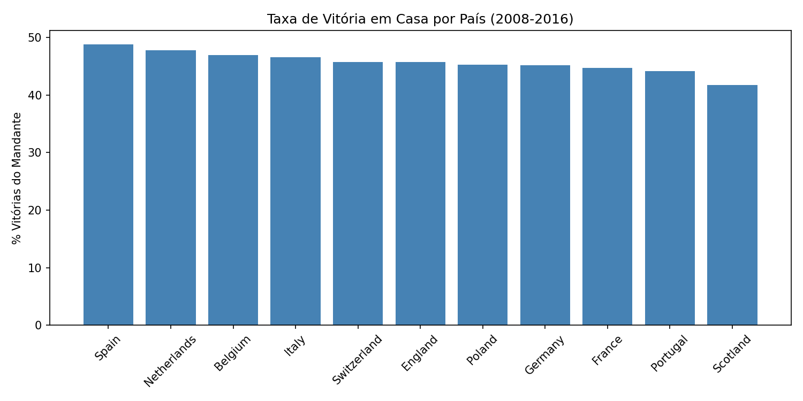
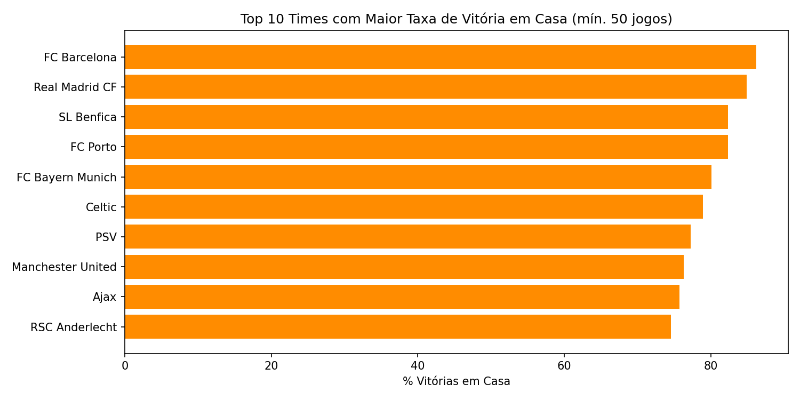
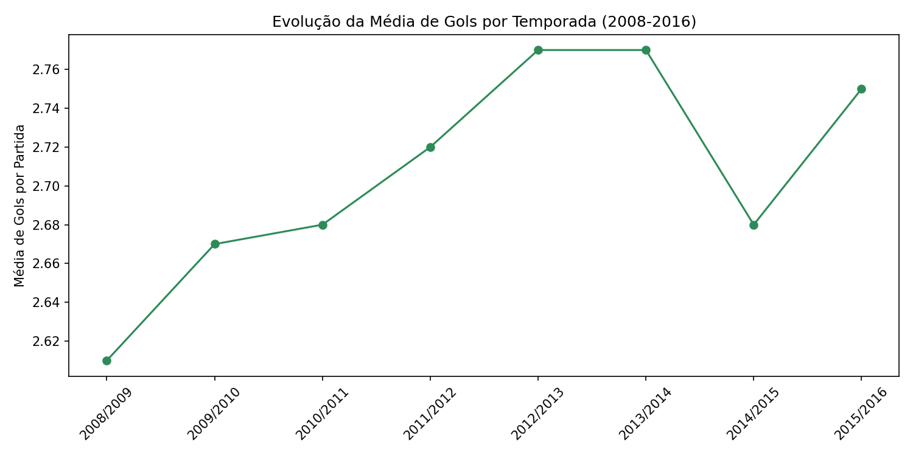

# Football Match Analysis (2008-2016)

Exploratory data analysis of European football matches using Python, SQL, and the [European Soccer Database](https://www.kaggle.com/datasets/hugomathien/soccer) (Kaggle).

## Business Question
What factors influence match outcomes, and how strong is home-field advantage across European leagues?

## Data
- Source: European Soccer Database (SQLite), ~26,000 matches from 11 countries, 2008-2016
- Tools: Python (pandas), SQL (SQLite), Matplotlib

## Approach
1. Loaded match, team, and country data from the SQLite database
2. Cleaned and merged tables to get readable team/country names
3. Wrote SQL queries to answer business questions
4. Visualized results with Matplotlib

## Key Findings

**1. Home advantage is real:** home teams win 45.9% of matches vs. 28.7% for away teams (25.4% draws).

**2. Home advantage varies by country:** Spain has the strongest home advantage (48.8% home win rate), Scotland the weakest (41.7%).

**3. Top clubs dominate at home:** FC Barcelona (86.2%) and Real Madrid (84.9%) have the highest home win rates among teams with 50+ home games.

**4. Goals per match stayed fairly stable** across seasons, averaging 2.6-2.8 goals/match with no major upward or downward trend.

## How to Run
Open `football_analysis.ipynb` in Google Colab or Jupyter. The notebook downloads the dataset automatically via `kagglehub`.

## Tools
Python, pandas, SQLite, Matplotlib

## Author
Eduardo Souza
